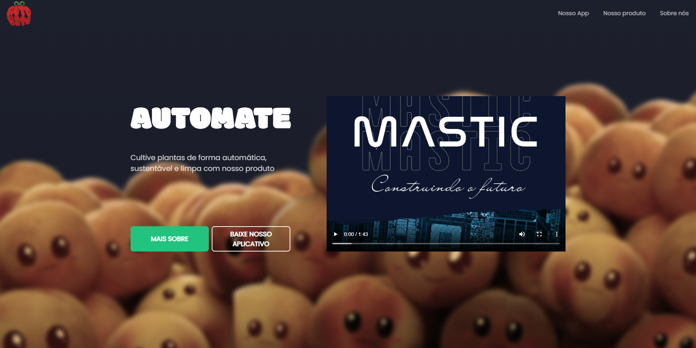

<h1 align="center"> AUTOMATE WEBSITE </h1>

    Site desenvolvido em tese de conclusão de TCC.

  <a href="#-tecnologias">Tecnologias</a>&nbsp;&nbsp;&nbsp;|&nbsp;&nbsp;&nbsp;
  <a href="#-projeto">Projeto</a>&nbsp;&nbsp;&nbsp;|&nbsp;&nbsp;&nbsp;
  <a href="#-layout">Layout</a>&nbsp;&nbsp;&nbsp;|&nbsp;&nbsp;&nbsp;

  

 

  

## 🚀 Tecnologias

Esse projeto foi desenvolvido com as seguintes tecnologias:

- ReactJS
- JavaScript e JSON
- StyledComponents
- [Node e Yarn](https://nodejs.org/)
- [Vite](https://vitejs.dev/)

## 💻 Projeto

Automate é nosso microcontrolador para cuidado de plantas de forma automatica.

## 🔖 Layout

Você pode visualizar o layout do projeto através [DESSE LINK](https://www.figma.com/file/gpqavL469k0pPUGOmAQEM9/Explorer-Lab-%2301/duplicate). É necessário ter conta no [Figma](https://figma.com) para acessá-lo.

